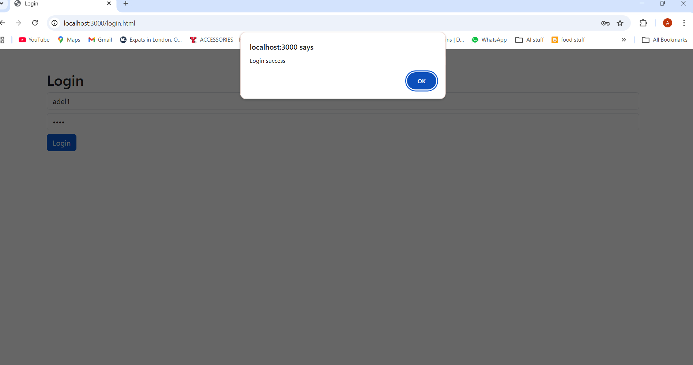
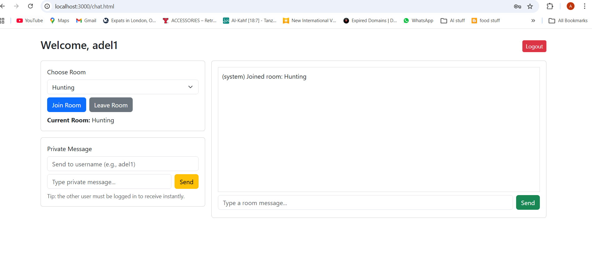
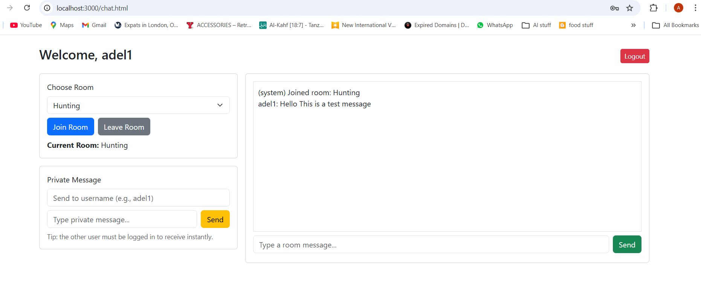
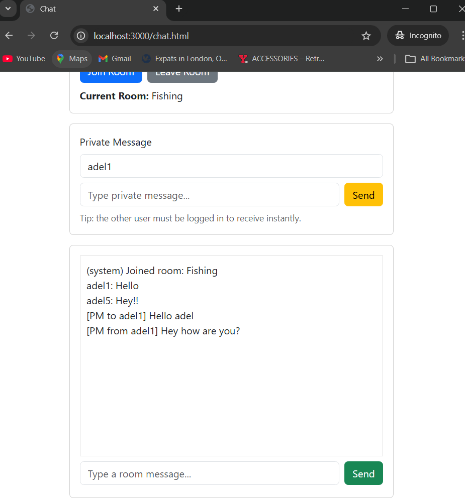
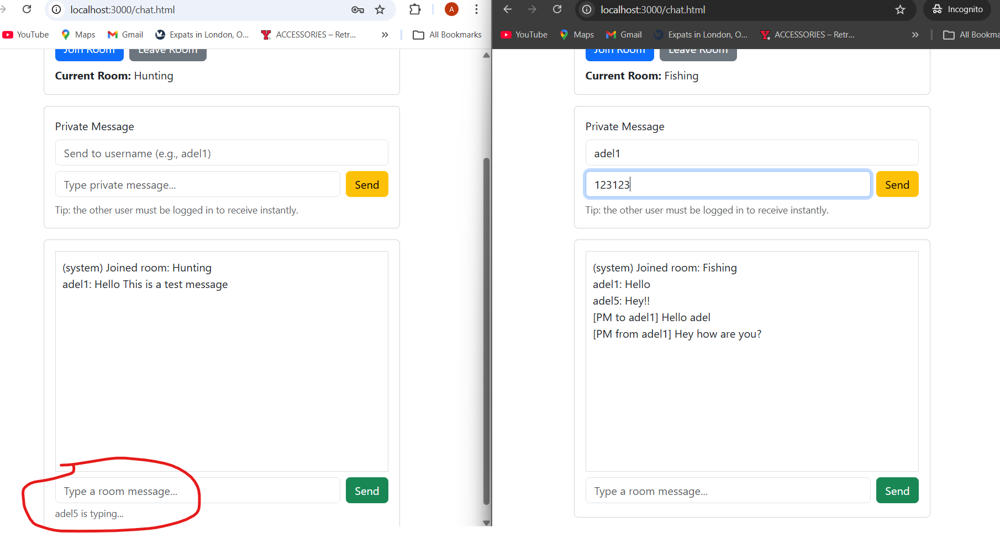

# Chat Application – COMP 3133 Lab Test 1

## Student Information

**Name:** Adel Alhajhussein  
**Student ID:** 101532466  
**Course:** COMP 3133  
**Lab Test:** 1

---

## Project Overview

This project is a real-time chat application developed as part of Lab Test 1.

The system allows users to:

- Create accounts (Signup)
- Authenticate (Login / Logout)
- Join and leave chat rooms
- Send real-time room messages
- Send private messages
- Store messages in MongoDB

---

## Technologies Used

### Backend
- Node.js
- Express.js
- Socket.io
- MongoDB
- Mongoose

### Frontend
- HTML
- CSS
- Bootstrap 5
- Fetch API

---

## Implemented Features

###  User Signup
- New users can register
- Unique username validation enforced
- User records stored in MongoDB

---

###  User Login / Logout
- Users authenticate using credentials
- Session handled using localStorage
- Logout clears session

---

### Room Management
- Users can join predefined rooms
- Users can leave rooms
- Messages restricted to active room

Example rooms:

- Hunting
- Fishing
- Camping
- Hiking
- Road Trips

---

###  Real-Time Room Chat
- Implemented using Socket.io
- Messages broadcast only within joined room
- Dynamic UI updates

---

###  MongoDB Persistence
- User data stored in MongoDB
- Group messages stored in MongoDB
- Private messages stored in MongoDB

---

###  Group Message Schema

Each room message stores:

- from_user
- room
- message
- date_sent

---

###  Private Message Schema

Each private message stores:

- from_user
- to_user
- message
- date_sent

---

### Typing Indicator
- Displays typing status
- Real-time updates via Socket.io

---

## Database Design

MongoDB is used for persistence.

Collections:

- Users
- GroupMessages
- PrivateMessages

Validation handled using Mongoose schemas.

---

## Application Screenshots

### Signup Page


---

### Login Page


---

### Join Room


---

### Room Chat


---

### Private Messaging


---

### Typing Indicator



## How to Run the Application

### 1️⃣ Start MongoDB

If using Docker:

```bash
docker run -d --name mongodb -p 27017:27017 mongo


